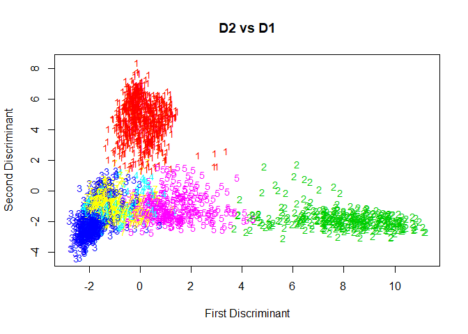
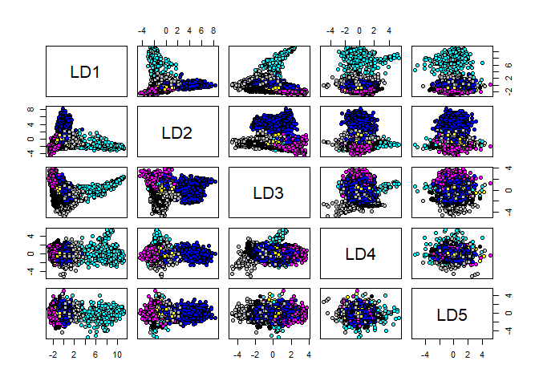

title: "Discriminant Analysis of SATELLITE IMAGE DATA"
author: "Masha"
date: "5/13/2020"
output: 
  md_document:
    variant: markdown_github

Libraries needed

``` r
library(klaR)
```

    ## Warning: package 'klaR' was built under R version 3.6.3

    ## Loading required package: MASS

    ## Warning: package 'MASS' was built under R version 3.6.2

``` r
library(MASS)
```

Importing the Data

``` r
SATimage =read.csv("C:/Users/fb8502oa/Desktop/Github stuff/Discriminant-Analysis-R-/SATimage (assign8).csv")  
SATimage = data.frame(class=as.factor(SATimage$class),SATimage[,1:36])
```

forming training and test sets

``` r
set.seed(888)# to have the same data
testcases = sample(1:dim(SATimage)[1],1000,replace=F)
SATtest = SATimage[testcases,]
SATtrain = SATimage[-testcases,]
```

looking at the dimensions

``` r
dim(SATtrain)
```

    ## [1] 3435   37

``` r
dim(SATtest)
```

    ## [1] 1000   37

making sure the test and training are fine

``` r
table(SATtrain$class)
```

    ## 
    ##   1   2   3   4   5   7 
    ## 820 374 739 323 368 811

``` r
table(SATtest$class)
```

    ## 
    ##   1   2   3   4   5   7 
    ## 252 105 222  92 102 227

FIRST MODEL LDA

``` r
SAT.lda = lda(class~., data = SATtrain)
summary(SAT.lda)
```

    ##         Length Class  Mode     
    ## prior     6    -none- numeric  
    ## counts    6    -none- numeric  
    ## means   216    -none- numeric  
    ## scaling 180    -none- numeric  
    ## lev       6    -none- character
    ## svd       5    -none- numeric  
    ## N         1    -none- numeric  
    ## call      3    -none- call     
    ## terms     3    terms  call     
    ## xlevels   0    -none- list

``` r
yfit = predict(SAT.lda, newdata = SATtrain)
attributes(yfit)
```

    ## $names
    ## [1] "class"     "posterior" "x"

Misclassification function (prof: Brant Deppas’s function)

``` r
misclass = function(fit,y) {
temp <- table(fit,y)
cat("Table of Misclassification\n")
cat("(row = predicted, col = actual)\n")
print(temp)
cat("\n\n")
numcor <- sum(diag(temp))
numinc <- length(y) - numcor
mcr <- numinc/length(y)
cat(paste("Misclassification Rate = ",format(mcr,digits=3)))
cat("\n")
}
```

Misclassification for the training set

``` r
misclass(yfit$class, SATtrain$class)
```

    ## Table of Misclassification
    ## (row = predicted, col = actual)
    ##    y
    ## fit   1   2   3   4   5   7
    ##   1 791   3   2   0  14   0
    ##   2   0 323   0   0   0   0
    ##   3  18   1 695  83   1  25
    ##   4   4   4  38 115  12  63
    ##   5   4  41   0   3 273   2
    ##   7   3   2   4 122  68 721
    ## 
    ## 
    ## Misclassification Rate =  0.151

ploting for two dimensions of

``` r
plot(yfit$x[,1], yfit$x[,2], type = "n",xlab = "First Discriminant", ylab= "Second Discriminant", main = "D2 vs D1")
text(yfit$x[,1], yfit$x[,2], as.character(yfit$class), col = as.numeric(yfit$class)+1, cex = 0.9)
```



scatterplot function

``` r
pairs.grps = function(x) {
  pairs(x[,-1],pch=21,bg=as.numeric(as.factor(x[,1]))+3)
}
```

scatter plots

``` r
poo = cbind(SATtrain$class,yfit$x)
pairs.grps(poo)
```



Misclassiffication of the test set.

``` r
ypred= predict(SAT.lda, newdata = SATtest)
misclass(ypred$class, SATtest$class)
```

    ## Table of Misclassification
    ## (row = predicted, col = actual)
    ##    y
    ## fit   1   2   3   4   5   7
    ##   1 245   0   1   0   3   0
    ##   2   0  89   0   0   0   0
    ##   3   4   1 208  23   0  10
    ##   4   1   0  13  30   2  14
    ##   5   2  14   0   0  76   1
    ##   7   0   1   0  39  21 202
    ## 
    ## 
    ## Misclassification Rate =  0.15

SUMMARY:

After splitting the data into a training and a test set, I fit the LDA
model with the training set. It had a misclassification rate of 0.151 in
the training set and a misclassification rate of 0.15 in the testing set

########## 

MODEL 2 QDA

``` r
SAT.qda = qda(class~.,data=SATtrain)
yfit = predict(SAT.qda,newdata=SATtrain)
attributes(yfit)
```

    ## $names
    ## [1] "class"     "posterior"

``` r
misclass(yfit$class,SATtrain$class)
```

    ## Table of Misclassification
    ## (row = predicted, col = actual)
    ##    y
    ## fit   1   2   3   4   5   7
    ##   1 804   0   7   1   6   0
    ##   2   2 372   4  10  11   9
    ##   3   8   0 704  78   1  20
    ##   4   0   0  12 119   0  16
    ##   5   6   2   3   2 326  22
    ##   7   0   0   9 113  24 744
    ## 
    ## 
    ## Misclassification Rate =  0.107

Now on the test cases

``` r
ypred = predict(SAT.qda,newdata=SATtest)
misclass(ypred$class, SATtest$class)
```

    ## Table of Misclassification
    ## (row = predicted, col = actual)
    ##    y
    ## fit   1   2   3   4   5   7
    ##   1 247   0   4   2   4   0
    ##   2   0 104   0   5   7   4
    ##   3   3   0 207  24   0   8
    ##   4   0   0   4  23   1   3
    ##   5   2   1   3   0  81   9
    ##   7   0   0   4  38   9 203
    ## 
    ## 
    ## Misclassification Rate =  0.135

SUMMARY: I used the training data to fit a QDA model which had a
misclassification rate of 0.107 in the training set and a
misclassification rate of 0.135 in the test set. Both the training and
test set performed better than the LDA model’s.

########## 

MODEL 3 RDA using klaR lib with function rda()

``` r
library(klaR)
SAT.rda = rda(class~., data = SATtrain)
attributes(SAT.rda)
```

    ## $names
    ##  [1] "call"           "regularization" "classes"        "prior"         
    ##  [5] "error.rate"     "varnames"       "means"          "covariances"   
    ##  [9] "covpooled"      "converged"      "iter"           "terms"         
    ## [13] "xlevels"       
    ## 
    ## $class
    ## [1] "rda"

looking for optimal settings

``` r
SAT.rda$regularization
```

    ##      gamma     lambda 
    ## 0.06524005 0.82844611

``` r
SAT.rda$error.rate
```

    ##      APER  crossval 
    ## 0.1342067 0.1423923

Now looking at the test cases

``` r
ypred = predict(SAT.rda, newdata = SATtest)
misclass(ypred$class, SATtest$class)
```

    ## Table of Misclassification
    ## (row = predicted, col = actual)
    ##    y
    ## fit   1   2   3   4   5   7
    ##   1 245   0   1   0   4   0
    ##   2   0 102   0   0   3   1
    ##   3   5   0 213  24   1  10
    ##   4   0   0   6  31   1  11
    ##   5   2   3   0   0  67   1
    ##   7   0   0   2  37  26 204
    ## 
    ## 
    ## Misclassification Rate =  0.138

TUNING PARAMETERS FOR THE RDA MODEL

``` r
SAT.rda2 = rda(class~., data = SATtrain, lambda = 0.70, gamma =0.002)
pred.rda2 = predict(SAT.rda2, newdata = SATtest)
misclass(pred.rda2$class, SATtest$class)
```

    ## Table of Misclassification
    ## (row = predicted, col = actual)
    ##    y
    ## fit   1   2   3   4   5   7
    ##   1 249   0   1   0   2   0
    ##   2   0 104   0   2   6   3
    ##   3   3   0 214  27   0  10
    ##   4   0   0   6  25   1   6
    ##   5   0   1   0   1  74   1
    ##   7   0   0   1  37  19 207
    ## 
    ## 
    ## Misclassification Rate =  0.127

SUMMARY:

I used the klaR library to fit a RDA model and it had a gamma of
0.00208and a lambda of 0.74130 as its optimal setting for 10 folds. The
estimated error rate from 10 folds cv results was 0.11558 to after cross
- validation 0.14062. This model had a misclassification rate of 0.1406
on the training set and a misclassification rate of 0.129 on the test
set.

tuning parameter function (prof: Brant Deppa’s function)

``` r
find.gamlam = function(formula,train,test,ming=0,maxg=1,minl=0,maxl=1,k=5){
    lambda = seq(minl,maxl,length=k)
    gamma = seq(ming,maxg,length=k)
    mcr = rep(0,as.integer(k^2))
    ntest = dim(test)[1]
    lg.grid = expand.grid(lambda=lambda,gamma=gamma)
    for (i in 1:as.integer(k^2)){
        temp = rda(formula,data=train,lambda=lg.grid[i,1],gamma=lg.grid[i,2])
        pred = predict(temp,newdata=test)$class
        numinc = ntest - sum(diag(table(pred,test[,1])))
        mcr[i] = numinc/ntest
    }
    cbind(lg.grid,mcr)
}
```

finding the tuning parameters

``` r
find.gamlam(class~., train = SATtrain, test = SATtest, k =10)
```

    ##        lambda     gamma   mcr
    ## 1   0.0000000 0.0000000 0.135
    ## 2   0.1111111 0.0000000 0.133
    ## 3   0.2222222 0.0000000 0.131
    ## 4   0.3333333 0.0000000 0.129
    ## 5   0.4444444 0.0000000 0.129
    ## 6   0.5555556 0.0000000 0.126
    ## 7   0.6666667 0.0000000 0.129
    ## 8   0.7777778 0.0000000 0.128
    ## 9   0.8888889 0.0000000 0.134
    ## 10  1.0000000 0.0000000 0.150
    ## 11  0.0000000 0.1111111 0.125
    ## 12  0.1111111 0.1111111 0.129
    ## 13  0.2222222 0.1111111 0.130
    ## 14  0.3333333 0.1111111 0.136
    ## 15  0.4444444 0.1111111 0.138
    ## 16  0.5555556 0.1111111 0.140
    ## 17  0.6666667 0.1111111 0.135
    ## 18  0.7777778 0.1111111 0.137
    ## 19  0.8888889 0.1111111 0.140
    ## 20  1.0000000 0.1111111 0.147
    ## 21  0.0000000 0.2222222 0.129
    ## 22  0.1111111 0.2222222 0.140
    ## 23  0.2222222 0.2222222 0.145
    ## 24  0.3333333 0.2222222 0.149
    ## 25  0.4444444 0.2222222 0.144
    ## 26  0.5555556 0.2222222 0.144
    ## 27  0.6666667 0.2222222 0.142
    ## 28  0.7777778 0.2222222 0.139
    ## 29  0.8888889 0.2222222 0.141
    ## 30  1.0000000 0.2222222 0.148
    ## 31  0.0000000 0.3333333 0.133
    ## 32  0.1111111 0.3333333 0.137
    ## 33  0.2222222 0.3333333 0.144
    ## 34  0.3333333 0.3333333 0.145
    ## 35  0.4444444 0.3333333 0.144
    ## 36  0.5555556 0.3333333 0.146
    ## 37  0.6666667 0.3333333 0.141
    ## 38  0.7777778 0.3333333 0.139
    ## 39  0.8888889 0.3333333 0.142
    ## 40  1.0000000 0.3333333 0.143
    ## 41  0.0000000 0.4444444 0.133
    ## 42  0.1111111 0.4444444 0.135
    ## 43  0.2222222 0.4444444 0.144
    ## 44  0.3333333 0.4444444 0.143
    ## 45  0.4444444 0.4444444 0.141
    ## 46  0.5555556 0.4444444 0.139
    ## 47  0.6666667 0.4444444 0.140
    ## 48  0.7777778 0.4444444 0.145
    ## 49  0.8888889 0.4444444 0.146
    ## 50  1.0000000 0.4444444 0.143
    ## 51  0.0000000 0.5555556 0.128
    ## 52  0.1111111 0.5555556 0.137
    ## 53  0.2222222 0.5555556 0.138
    ## 54  0.3333333 0.5555556 0.139
    ## 55  0.4444444 0.5555556 0.141
    ## 56  0.5555556 0.5555556 0.143
    ## 57  0.6666667 0.5555556 0.148
    ## 58  0.7777778 0.5555556 0.149
    ## 59  0.8888889 0.5555556 0.155
    ## 60  1.0000000 0.5555556 0.153
    ## 61  0.0000000 0.6666667 0.135
    ## 62  0.1111111 0.6666667 0.141
    ## 63  0.2222222 0.6666667 0.144
    ## 64  0.3333333 0.6666667 0.146
    ## 65  0.4444444 0.6666667 0.148
    ## 66  0.5555556 0.6666667 0.151
    ## 67  0.6666667 0.6666667 0.150
    ## 68  0.7777778 0.6666667 0.161
    ## 69  0.8888889 0.6666667 0.157
    ## 70  1.0000000 0.6666667 0.163
    ## 71  0.0000000 0.7777778 0.146
    ## 72  0.1111111 0.7777778 0.154
    ## 73  0.2222222 0.7777778 0.166
    ## 74  0.3333333 0.7777778 0.167
    ## 75  0.4444444 0.7777778 0.168
    ## 76  0.5555556 0.7777778 0.169
    ## 77  0.6666667 0.7777778 0.173
    ## 78  0.7777778 0.7777778 0.174
    ## 79  0.8888889 0.7777778 0.183
    ## 80  1.0000000 0.7777778 0.185
    ## 81  0.0000000 0.8888889 0.176
    ## 82  0.1111111 0.8888889 0.182
    ## 83  0.2222222 0.8888889 0.184
    ## 84  0.3333333 0.8888889 0.186
    ## 85  0.4444444 0.8888889 0.186
    ## 86  0.5555556 0.8888889 0.187
    ## 87  0.6666667 0.8888889 0.182
    ## 88  0.7777778 0.8888889 0.184
    ## 89  0.8888889 0.8888889 0.190
    ## 90  1.0000000 0.8888889 0.194
    ## 91  0.0000000 1.0000000 0.210
    ## 92  0.1111111 1.0000000 0.211
    ## 93  0.2222222 1.0000000 0.211
    ## 94  0.3333333 1.0000000 0.214
    ## 95  0.4444444 1.0000000 0.213
    ## 96  0.5555556 1.0000000 0.214
    ## 97  0.6666667 1.0000000 0.213
    ## 98  0.7777778 1.0000000 0.214
    ## 99  0.8888889 1.0000000 0.216
    ## 100 1.0000000 1.0000000 0.218

``` r
find.gamlam(class~., train = SATtrain, test = SATtest, k =10, minl = 0.40, maxl = 0.56, ming = 0, maxg = 0.001)
```

    ##        lambda        gamma   mcr
    ## 1   0.4000000 0.0000000000 0.128
    ## 2   0.4177778 0.0000000000 0.129
    ## 3   0.4355556 0.0000000000 0.129
    ## 4   0.4533333 0.0000000000 0.128
    ## 5   0.4711111 0.0000000000 0.128
    ## 6   0.4888889 0.0000000000 0.129
    ## 7   0.5066667 0.0000000000 0.128
    ## 8   0.5244444 0.0000000000 0.127
    ## 9   0.5422222 0.0000000000 0.125
    ## 10  0.5600000 0.0000000000 0.126
    ## 11  0.4000000 0.0001111111 0.128
    ## 12  0.4177778 0.0001111111 0.129
    ## 13  0.4355556 0.0001111111 0.130
    ## 14  0.4533333 0.0001111111 0.129
    ## 15  0.4711111 0.0001111111 0.129
    ## 16  0.4888889 0.0001111111 0.130
    ## 17  0.5066667 0.0001111111 0.129
    ## 18  0.5244444 0.0001111111 0.126
    ## 19  0.5422222 0.0001111111 0.125
    ## 20  0.5600000 0.0001111111 0.126
    ## 21  0.4000000 0.0002222222 0.129
    ## 22  0.4177778 0.0002222222 0.130
    ## 23  0.4355556 0.0002222222 0.130
    ## 24  0.4533333 0.0002222222 0.129
    ## 25  0.4711111 0.0002222222 0.129
    ## 26  0.4888889 0.0002222222 0.130
    ## 27  0.5066667 0.0002222222 0.129
    ## 28  0.5244444 0.0002222222 0.127
    ## 29  0.5422222 0.0002222222 0.125
    ## 30  0.5600000 0.0002222222 0.126
    ## 31  0.4000000 0.0003333333 0.129
    ## 32  0.4177778 0.0003333333 0.130
    ## 33  0.4355556 0.0003333333 0.130
    ## 34  0.4533333 0.0003333333 0.129
    ## 35  0.4711111 0.0003333333 0.129
    ## 36  0.4888889 0.0003333333 0.130
    ## 37  0.5066667 0.0003333333 0.129
    ## 38  0.5244444 0.0003333333 0.127
    ## 39  0.5422222 0.0003333333 0.126
    ## 40  0.5600000 0.0003333333 0.126
    ## 41  0.4000000 0.0004444444 0.129
    ## 42  0.4177778 0.0004444444 0.130
    ## 43  0.4355556 0.0004444444 0.130
    ## 44  0.4533333 0.0004444444 0.129
    ## 45  0.4711111 0.0004444444 0.129
    ## 46  0.4888889 0.0004444444 0.130
    ## 47  0.5066667 0.0004444444 0.129
    ## 48  0.5244444 0.0004444444 0.127
    ## 49  0.5422222 0.0004444444 0.126
    ## 50  0.5600000 0.0004444444 0.127
    ## 51  0.4000000 0.0005555556 0.129
    ## 52  0.4177778 0.0005555556 0.130
    ## 53  0.4355556 0.0005555556 0.130
    ## 54  0.4533333 0.0005555556 0.129
    ## 55  0.4711111 0.0005555556 0.129
    ## 56  0.4888889 0.0005555556 0.130
    ## 57  0.5066667 0.0005555556 0.128
    ## 58  0.5244444 0.0005555556 0.127
    ## 59  0.5422222 0.0005555556 0.126
    ## 60  0.5600000 0.0005555556 0.127
    ## 61  0.4000000 0.0006666667 0.129
    ## 62  0.4177778 0.0006666667 0.130
    ## 63  0.4355556 0.0006666667 0.129
    ## 64  0.4533333 0.0006666667 0.129
    ## 65  0.4711111 0.0006666667 0.129
    ## 66  0.4888889 0.0006666667 0.130
    ## 67  0.5066667 0.0006666667 0.128
    ## 68  0.5244444 0.0006666667 0.127
    ## 69  0.5422222 0.0006666667 0.126
    ## 70  0.5600000 0.0006666667 0.127
    ## 71  0.4000000 0.0007777778 0.129
    ## 72  0.4177778 0.0007777778 0.130
    ## 73  0.4355556 0.0007777778 0.129
    ## 74  0.4533333 0.0007777778 0.129
    ## 75  0.4711111 0.0007777778 0.129
    ## 76  0.4888889 0.0007777778 0.130
    ## 77  0.5066667 0.0007777778 0.128
    ## 78  0.5244444 0.0007777778 0.127
    ## 79  0.5422222 0.0007777778 0.126
    ## 80  0.5600000 0.0007777778 0.127
    ## 81  0.4000000 0.0008888889 0.128
    ## 82  0.4177778 0.0008888889 0.130
    ## 83  0.4355556 0.0008888889 0.129
    ## 84  0.4533333 0.0008888889 0.129
    ## 85  0.4711111 0.0008888889 0.129
    ## 86  0.4888889 0.0008888889 0.130
    ## 87  0.5066667 0.0008888889 0.128
    ## 88  0.5244444 0.0008888889 0.127
    ## 89  0.5422222 0.0008888889 0.126
    ## 90  0.5600000 0.0008888889 0.127
    ## 91  0.4000000 0.0010000000 0.128
    ## 92  0.4177778 0.0010000000 0.130
    ## 93  0.4355556 0.0010000000 0.129
    ## 94  0.4533333 0.0010000000 0.129
    ## 95  0.4711111 0.0010000000 0.129
    ## 96  0.4888889 0.0010000000 0.130
    ## 97  0.5066667 0.0010000000 0.128
    ## 98  0.5244444 0.0010000000 0.127
    ## 99  0.5422222 0.0010000000 0.126
    ## 100 0.5600000 0.0010000000 0.127

SUMMARY: Using find.gamlam function, I fit a model with 10 k\_fold
validations, a min lambda of 0.40, a max lambda of 0.56, a min gamma of
0 and a max gamma of 0.001. The optimal lambda was 0.542 and the optimal
gamma was 0.0

LOKKING AT THE FINAL RDA MODEL

``` r
SAT.rda3 = rda(class~., data = SATtrain, gamma= 0.0, lambda = 0.542)
yfti = predict(SAT.rda3, newdata = SATtrain)
misclass(yfit$class, SATtrain$class)
```

    ## Table of Misclassification
    ## (row = predicted, col = actual)
    ##    y
    ## fit   1   2   3   4   5   7
    ##   1 804   0   7   1   6   0
    ##   2   2 372   4  10  11   9
    ##   3   8   0 704  78   1  20
    ##   4   0   0  12 119   0  16
    ##   5   6   2   3   2 326  22
    ##   7   0   0   9 113  24 744
    ## 
    ## 
    ## Misclassification Rate =  0.107

looking at its test cases

``` r
ypred = predict(SAT.rda3,newdata = SATtest)
misclass(ypred$class, SATtest$class)
```

    ## Table of Misclassification
    ## (row = predicted, col = actual)
    ##    y
    ## fit   1   2   3   4   5   7
    ##   1 249   0   1   1   2   0
    ##   2   0 105   0   3   7   3
    ##   3   3   0 214  26   0  10
    ##   4   0   0   5  26   1   4
    ##   5   0   0   0   0  73   2
    ##   7   0   0   2  36  19 208
    ## 
    ## 
    ## Misclassification Rate =  0.125

SUMMARY:

I got the best model after fitting it with the optimal lambda and gamma.
It had a misclassification rate of 0.107 on the training set and a
misclassification rate of 0.125 on the test set.
